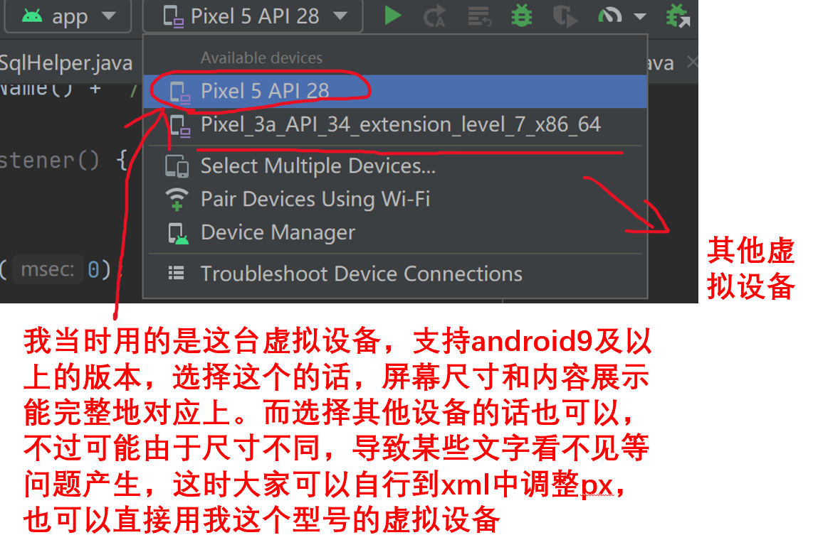
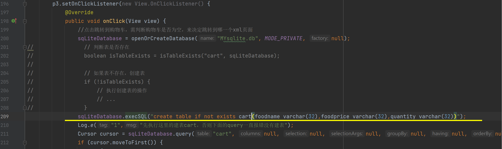
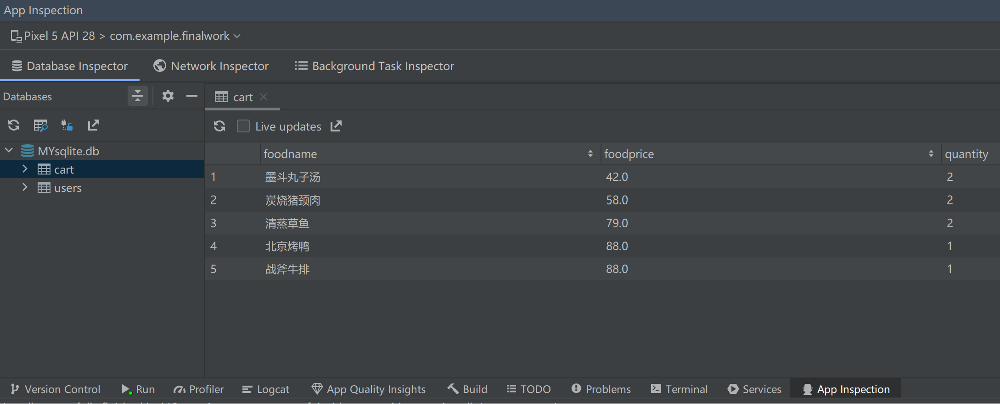

## 项目目录
`FinalWork\app\src\main`
FinalWork是我的整个工程，大家**直接在android studio里面打开这个项目就行（不用新建项目，打开我这个文件就可以）**
**里面main路径下的java和xml代码才是我最终的程序代码**
`src\androidTest`和`src\test`两个目录下的文件，均是我测试用的java和xml代码
与`src`平级的`testwork`、`testwork2`是我测试用的两个app，大家可以不用管

## 项目bug修改
### 1. 工程优化说明
原本我做完大作业后，以为把工程文件删了，只有java和xml代码，所以大家拿到我的网盘链接只有我当时提交作业的内容（java+xml代码+课程设计报告）。但是电脑重装后，我重新翻了下文件，发现其实工程还在，只不过我当时删除的是整个android studio和几个G的sdk环境，还把虚拟设备删除了。不过大家拿到我发的文件后，只要你们有android studio软件，装好sdk和一台虚拟手机设备，把我这个工程导入进去后，就应该可以运行了。

我在今天（2023.12.20）还专门重新将android studio下载回来（跟我之前的是不同的版本），装好配置，重新将文件导入进项目运行，结果发现是可以的，我相信大家应该也没问题。

### 2. 虚拟设备
虚拟设备是用来展示你制作的app的手机，可以在电脑上运行进行调试和效果演示，相关解释如下：

### 3. 跳转失效，app无响应or被强制关闭
这也是许多小伙伴问我的问题，我自己进行运行时也发现了，先说原因：

**无法找到cart表,导致query查询该表的操作失效**

在查看Logcat运行日志文件即可发现该问题，仔细看发现问题在MainActivity.java的211行，执行query cart操作时，之前没有建立cart表，导致程序报错，因此我在查询之前加了建表语句，示意图如下：

可以看到我在query之前的209行，新增了一个执行建表sql的操作
注意：我加了这句代码之后，在项目运行时首先会跳转到首页，这时大家下一步操作要点击下方导航栏的购物车那个文本按钮，不要乱点其他！否则程序还是会报错，直接退出app！因为你点击其他页面也会跳转，要跳转的页面也包含`查询cart表`的操作，导致没有cart表而报错，大家不嫌麻烦可以在每个页面跳转之前都在对应java文件的点击事件里加上`if not exits cart 就建表`的语句，或者有比我更好的处理逻辑但我暂时想不到，嫌麻烦的小伙伴就直接按我操作进行，如下图：

一旦你点击了购物车按钮，MainActivity的`onClick`方法就会被调用执行，里面有建立cart表的语句，因此之后你的数据库就一直有`user`和`cart`两张表了(如下图)，只要不手动删除表，项目的任何操作应该都是没有问题的。自此，大功告成！！！

## 补充说明
不知道有没有小伙伴有这样的问题：为什么注册时要操作user表，当时也没建表就直接查询，怎么就不报错呢？
我上网查了些资料后发现，应该是第一个建表时也是对新建的数据库`MYsqlite.db`进行的第一次操作，因此会执行数据库的初始化代码`onCreate`方法，里面就有我之前写好的建表语句
但是在查询Cart表时，此时由于数据库`MYsqlite.db`已经存在，不再执行`onCreate`方法，且没有建表语句，直接query查询肯定报错，导致app闪退
但是up我之前怎么可以运行呢？我猜应该是我当时做测试时一直手动新建表删除表之类的，将数据库版本升级到2.0了（原本数据库版本是1.0，对数据库的进行表的新增，删除等操作应该是会更新数据库的版本的），导致版本升级时它执行了`onUpgrade`方法，在里面我有写建表语句，因此没有报错，之后也就没发现这个问题了